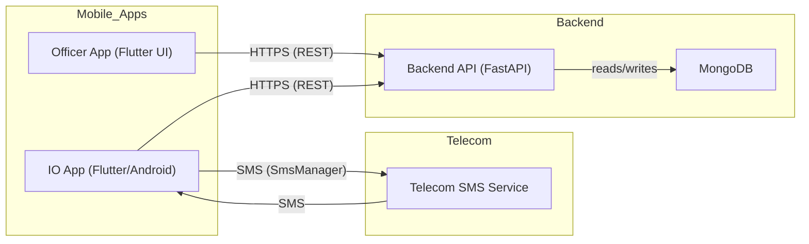
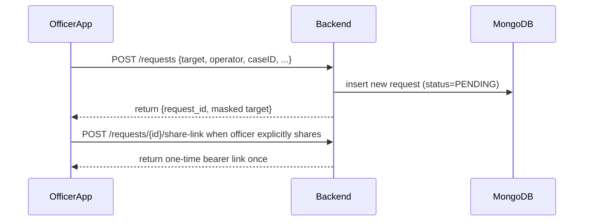
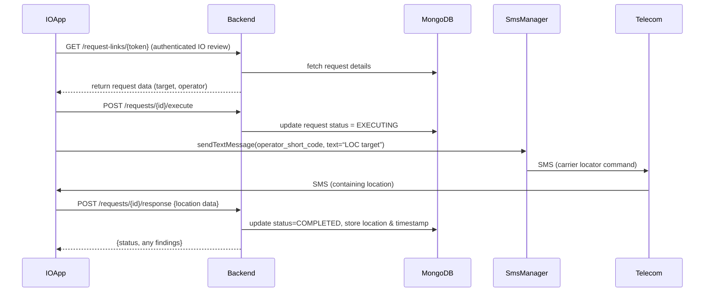

# Architecture

## Executive Summary

This document describes the architecture of the **IFSO Location Request Management System**.  The system consists of two mobile apps (Officer and IO roles), a Python/FastAPI backend, and a MongoDB database.  Officers submit a target mobile number (with operator info) via the Officer App; this creates a location request in the backend. The IO later authorizes the request via a secure link in the IO App, which then sends an SMS to the telecom operator from the IO’s device. The telecom responds via SMS with the target’s location, which the IO App captures and submits back to the backend.  All communication between apps and backend uses HTTPS/TLS.  The architecture is fully static-analysis–friendly: the system never executes or processes unknown code, only relays SMS-based queries. 

**Assumptions:** This is an internal, organization-deployed system.  IO devices are enterprise-managed (MDM) and carry authorized SIMs.  The telecom operators will provide the exact SMS shortcodes and message formats (currently *unknown*).  Officer/IO users are authenticated (e.g. via JWT/OAuth2).  The apps are **not** on public app stores (they will be sideloaded or distributed via MDM).  Any unsaid detail (e.g. operator-specific SMS templates, case ID formats) is flagged as an unknown in the *Integration Points* section below. 

## System Components

The main components are: the **Officer App** (Flutter), the **IO App** (Flutter with SMS integration), the **Backend API** (Python/FastAPI), the **Database** (MongoDB), and the **Telecom SMS Service** (external carrier).  The high-level data and control flow is shown below.

```
   +-------------+      HTTPS        +--------------+      +---------------+
   | Officer App | --------------->  | Backend API  | <--- |   IO App      |
   |  (Flutter)  |                   |  (FastAPI)   |      | (Flutter UI,  |
   +-------------+                   +------+-------+      |   SmsManager) |
                                        |                 +---------------+
                                        | 
                                        v
                                   +---------+
                                   | MongoDB |
                                   +---------+
                                         
                                     [Telecom Carrier SMS]                                   
                                              ^                        
                                              | 
                 SMS (location request and response)                         
                                              |
                                       +---------------+
                                       |   Telecom     |
                                       |    SMS Svc    |
                                       +---------------+
```

- **Officer App (Flutter UI)** – Used by investigating officers to submit location requests. Sends data to the Backend over HTTPS (JSON REST).  
- **IO App (Flutter on Android)** – Used by the Investigating Officer (IO). Displays pending requests to approve. On approval, it uses Android’s `SmsManager` to send the location-query SMS from the IO device’s SIM, then listens for the SMS reply.  
- **Backend API (Python/FastAPI)** – Orchestrates requests, handles authentication (e.g. JWT/OAuth2), stores request records, and returns data to apps.  It provides RESTful endpoints (e.g. `POST /requests`, `GET /requests/{id}`, etc.) consumed by the mobile apps.  
- **MongoDB Database** – Stores all request records, user cases, and audit logs in a document-oriented format.  This is accessed only by the Backend API via an authenticated driver.  
- **Telecom SMS Service** – External carrier system that receives an SMS and replies with the subscriber’s location. The IO App sends SMS to this service and receives the response via SMS. 



### Component Responsibilities and Interfaces

| Component        | Responsibility                                    | Interfaces & Data Flows                   | Failure Modes (Notes)                    |
|------------------|---------------------------------------------------|-------------------------------------------|------------------------------------------|
| **Officer App**  | Provide UI to create/share location requests.     |  HTTP POST to `/requests` with bearer authentication (JSON containing target number, operator, case, remarks).<br> Calls explicit `/requests/{id}/share-link` when a one-time IO review link must be delivered. | – No network: cannot submit request.<br>– Invalid input: backend rejects.<br>– Needs `INTERNET` permission. |
| **IO App**       | Review pending requests; trigger SMS; capture response. |  HTTP GET `/requests/{id}` to fetch details.<br> HTTP POST `/requests/{id}/execute` to start execution.<br> Receives push updates from Backend (status).<br> Android SMS: Uses `android.telephony.SmsManager.sendTextMessage()` to send SMS; registers BroadcastReceiver for `android.provider.Telephony.SMS_RECEIVED` to capture reply.  | – SMS send fails (no signal, wrong number): should report error to user.<br>– SMS response never arrives: timeout or retry needed.<br>– If app not default SMS, it *can* still receive SMS via non-abortable broadcast. (Only default SMS apps get `SMS_DELIVER_ACTION`.)<br>– Requires `SEND_SMS` and `RECEIVE_SMS` permissions; these are sensitive (see Security section). |
| **Backend API**  | Core logic, authentication, data validation.      |  Exposes REST API (JSON). Uses HTTPS/TLS (must be configured).<br> Interacts with MongoDB via authenticated driver.<br> JWT/OAuth2 for user auth (supports standard protocols). | – Service offline: requests fail. <br>– Database down: data unavailable.<br>– Bugs: incorrect parsing of operator/number. <br>– Must validate inputs (no injection). |
| **Database**     | Store requests, operator profiles, audit logs.     |  Persists documents (requests: ID, target, operator, status, timestamps, etc.).<br> Accessed only by Backend. | – Data loss if no backups. <br>– Unencrypted sensitive data if not configured (resolve via encryption).<br>– Performance: many concurrent writes if many requests.  |
| **Telecom SMS**  | External system; processes location requests.      |  Receives SMS from IO’s SIM; replies via SMS. This is entirely outside our control. | – Carrier may not respond or format reply unexpectedly.<br>– Requires correct destination number/shortcode (unknown until configured).<br>– Legal constraints: only authorized SIMs get responses. |

## Sequence Diagrams

The following Mermaid diagrams illustrate the main flows. They assume all users are authenticated (tokens omitted for clarity).

1. **Officer creates a location request:** 



2. **IO executes the location request and handles SMS:**



These flows cover submission, approval, SMS dispatch, and response collection.  (Timeouts, retries, and user interface interactions would be managed at the app level, not shown here.)

## Repository Structure

A recommended project layout is:

```
ifso-location-request/
│
├── backend/
│   ├── app/
│   │   ├── main.py           # FastAPI entrypoint
│   │   ├── routes/
│   │   ├── services/
│   │   └── models/
│   ├── requirements.txt
│   └── Dockerfile           # (optional) containerize backend
│
├── mobile_app/
│   ├── pubspec.yaml
│   ├── lib/
│   │   ├── main_officer.dart   # (or one app with role switch)
│   │   ├── main_io.dart
│   │   ├── screens/
│   │   └── services/
│   ├── android/
│   └── ios/
│
├── tests/
│   ├── backend_tests/
│   └── mobile_tests/         # e.g. integration tests with Flutter
│
├── docs/
│   ├── Architecture.md
│   └── ... (PDR.md, rules.md from earlier)
│
├── .github/
│   └── workflows/            # CI/CD GitHub Actions
├── README.md
└── LICENSE
```

- The **backend** folder contains the FastAPI code.  Routes (e.g. `requests`, `execute`, `response`) live in `routes/`. Business logic (e.g. SMS template handling) goes in `services/`. Data models (Pydantic schemas, DB schemas) go in `models/`.  
- The **mobile_app** folder is a single Flutter project (or two flavor builds) containing the Officer and IO interfaces. If one codebase handles both roles, use separate `main.dart` entrypoints or screens guarded by role.  Key platform code (Android SMS integration in Kotlin/Java) may live under `android/`.  
- **Tests** should include unit tests for backend logic and integration tests (e.g. mocking HTTP calls).  Mobile tests (Flutter widget tests or integration) validate UI flows.  
- **CI/CD** scripts (e.g. GitHub Actions) should lint and test both backend and mobile, build artifacts, and possibly deploy the backend (e.g. container to cloud or on-prem server).

## Technology Stack

Use technologies aligned with your skills and project needs:

| Layer/Component    | Technology (Version)        | Usage & Rationale                                       |
|--------------------|-----------------------------|---------------------------------------------------------|
| **Mobile App**     | Flutter 3.x (Dart 3.x)      | Cross-platform UI. Flutter supports modern Android features and easy HTTP integration. Kotlin interop needed for SmsManager calls.  |
| **Android**        | Android 13/14 (API 33/34)   | Target recent Android for security features. Requires `android.hardware.telephony` feature to send SMS.  |
| **Backend**        | Python 3.11+                | Stable, widely used.                                      |
| **Web Framework**  | FastAPI (~0.95+)            | Async REST API. Built-in OpenAPI/Swagger support.  Supports OAuth2/JWT authentication.     |
| **DB Driver**      | Motor (async MongoDB) or PyMongo | Communicate with MongoDB efficiently.                    |
| **Database**       | MongoDB 8.3.8 (2026)| Document store for flexible schema (requests can vary by operator). Use the latest stable for features. |
| **HTTP/TLS**       | TLS 1.2+/HTTPS              | Encrypt all REST traffic. (“https://” means transport encryption.)           |
| **Authentication** | OAuth2 + JWT tokens         | Secure API endpoints. Built-in FastAPI support.|
| **Logging/Audit**  | Structured logs (JSON)      | Log every request/response with timestamps for audit trail.  |
| **CI/CD**          | GitHub Actions or similar   | Build/test/deploy pipeline.  Flutter builds, Python lint/tests.   |

**Rationale Examples:** Flutter enables rapid UI development; FastAPI’s async model handles concurrent requests smoothly; MongoDB suits semi-structured data; TLS protects data in transit; JWT tokens allow stateless secure auth. 

## Security & Hardening Checklist

- **Authentication/Authorization:** All API calls must include a valid bearer token. In the current Phase 2 backend, local static bearer tokens are limited to development/testing and are rejected outside those environments. Production/staging must use an external identity provider. Role-based access is explicit: Officers can create and access their own requests, IO/Admin principals can review requests for the IO workflow, and the share-link redemption endpoint requires IO/Admin authentication.  
- **Transport Encryption:** Enforce HTTPS/TLS for all communication. Even on internal LAN, use TLS (certificate from enterprise CA). *Never* send sensitive data (target numbers, results) over plaintext. As Google notes, `https://` ensures transport encryption.  
- **Data Encryption:** Store sensitive fields encrypted at rest. The Phase 2 backend encrypts normalized target phone numbers at the application layer before MongoDB persistence while retaining a masked value and non-reversible hash for display/lookup. Staging/production must provide an explicit field-encryption key; development/testing may derive a local-only key from `SECRET_KEY`.
- **Input Validation:** Validate/normalize all input (numbers, operator codes) on the backend to prevent injection or errors. Do **not** trust user-supplied operator codes or formats. Use parameterized queries in DB.  
- **Android Permissions:**  The IO app requires `<uses-permission android:name="android.permission.SEND_SMS"/>` and `<uses-permission android:name="android.permission.RECEIVE_SMS"/>`. These are **dangerous** permissions. On Android 6.0+, request them at runtime. The app should be marked (in manifest) with `<uses-feature android:name="android.hardware.telephony" android:required="true"/>` so it only installs on SMS-capable devices.  Only the default SMS app can write to the SMS Provider or get SMS_DELIVER_ACTION; our app will listen to the non-abortable `SMS_RECEIVED_ACTION` broadcast to get the operator’s reply.  
- **API Rate-Limiting:** Implement throttling on critical endpoints (`/execute`) to prevent abuse.  (An attacker or bug could attempt mass queries.)  
- **Audit Logging:** Log every request/response with user ID, timestamp, and outcome. Record who created/executed each request. This satisfies forensic requirements. Logs should be write-once if possible.  
- **Least Privilege:** The backend service account should have minimal DB privileges (only its specific DB/collections). The mobile app should only access its own API resources.  
- **Key/Secret Management:** Don’t hardcode API keys or credentials. Use environment variables or a secret manager for e.g. database URI, JWT signing key. Mobile apps should not embed sensitive keys.  
- **Device Security:** Since the IO’s device holds the authorized SIM, it **must** be secure. Use Enterprise Mobile Device Management (MDM) to enforce strong device PIN/passcode, full-disk encryption, and allow remote wipe. If a device is lost, it should be revocable immediately.  
- **Play Store Policy:** Although this app is internal, if ever submitting to Google Play, note that **SMS permissions** are restricted by policy (only default SMS apps or approved use-cases are allowed). See Android’s Telephony docs. For now, assume sideload/MDM deployment.  
- **Data Retention:** Purge old requests per policy. Do not keep personal data longer than needed. Ensure backups and logs comply with privacy laws.  
- **Assumptions:** We assume IO users are trusted and will not share their device/SIM. The system does not itself determine illegality; it only automates an authorized request.

## Deployment Plan

- **Environments:** Maintain separate *dev*, *test*, and *prod* environments. For dev, use test phone numbers and possibly a mock SMS service. The test environment can use a sandbox telecom if available. Production connects to the real carrier SMS.  
- **Backend Deployment:** Containerize the FastAPI (Docker) or deploy on a secured Linux server. Expose only HTTPS port (e.g. 443). Place backend behind a firewall/VPN accessible only to known mobile network ranges if possible.  
- **Mobile App Distribution:** Because of sensitive SMS permissions, distribute the APK outside of public stores. Options:
  - **Sideload** via USB or internal sharing (less secure).
  - **Enterprise MDM:** Preferred. Push the app to enrolled devices (see MDM discussion). This also enforces app signing and security policies.  
- **CI/CD:** Use GitHub Actions or similar to automate builds. Pipeline steps: 
  1. Lint and unit-test backend Python.
  2. Build a Docker image or deployable artifact for backend.
  3. Run Flutter analyzer/tests; build the APKs for Officer and IO. 
  4. (Optional) Automate deployment to internal artifact repo or MDM. 
- **Backups:** Configure regular backups of MongoDB (daily snapshot or continuous replication). Secure backups in a separate storage with encryption. Also backup source code (via version control) and configuration.  
- **Monitoring:** Run basic health checks. Log errors (e.g. SMS failure) and set up alerts (e.g. email on repeated failures). Use service tools (Grafana, Sentry, or even simple logs) to detect issues. 
- **Rollback/Updates:** Plan for app updates. With MDM, it can push updates. Backend should support versioning or a maintenance window. Before rolling out new versions, test the SMS loop end-to-end in a staging environment.
- **Physical/Network Security:** The backend server should run on a secure network. Use TLS certificates (from internal CA). Disable any unused services. Keep OS and libraries patched.

## Operational Runbook

1. **Testing SMS Loop:** Before deployment, verify the SMS workflow on a test device with a test SIM. Use known test numbers. Ensure the IO App catches the SMS and the backend records it. Perform this test after any change to SMS code.  
2. **Operator Profile Management:** Whenever a new carrier or SMS format is added, update the backend’s operator configuration (shortcode, message template, parser regex). Document this procedure.  
3. **New Device Enrollment:** Onboard each IO’s device via MDM or secure provisioning. Ensure the device’s SIM is registered. Store a record of authorized IO phone numbers in the database.  
4. **Incident Handling:** If an IO device is lost or a SIM is compromised, immediately mark any pending requests from that IO as invalid, and log the incident. Notify network security to disable the SIM if possible.  
5. **Monitoring & Alerts:** Weekly check: number of pending requests (should be low), number of failed SMS sends. Investigate any anomalies.  
6. **Error Recovery:** If an SMS send fails (carrier busy/blocked), the IO App should allow retry. Backend can support a “resend” endpoint. After 3 failures, alert the operator manually.  
7. **Data Audit:** Periodically audit the DB to ensure completed requests have results and no partial data. Verify retention policy (e.g. delete >90-day-old data).
8. **Documentation:** Keep an up-to-date diagram and changelog of operator SMS codes and any regex for parsing location replies. This is a key integration point (see below).  

## Integration Points & Assumptions

- **Operator SMS Templates (UNKNOWN):** We assume each carrier (Jio, Airtel, VI, BSNL, etc.) provides a specific SMS short code and message format for location queries. _Action:_ Validate with telco/legal teams. Backend will store these in an **Operator Profile**. 
- **Normalization Rules:** We assume country codes (“91” etc.) must be prefixed. Clarify: if officers supply a local number, prepend `91` for India; otherwise require fully qualified numbers. Implementation will handle basic normalization, but this must be agreed.
- **Case ID / Case Reference:** How to tag requests with case identifiers or officer IDs? The UI should allow free-form notes or a selected case. Backend data model must include any required fields for legal auditing (e.g. case number, requesting officer ID). 
- **Authentication Source:** Are we integrating with an existing user directory (LDAP/SAML)? For MVP, use simple username/password or tokens. Future work: single sign-on with IFSO credentials. 
- **Device Management:** Assumed MDM enrollment. If instead devices are personal (BYOD), security requirements are higher. Confirm device management policy. 
- **Play Store vs Private APK:** This solution assumes **private deployment**. If required to publish to Google Play in future, we must comply with the SMS permission policy (which generally forbids `SEND_SMS` unless default app) – likely not feasible. 
- **Legal/Governance:** Ensure location requests are logged for auditing and only used per authorized warrants. (Our design preserves all logs and results for this purpose.) 
- **Network Connectivity:** The IO App needs network access for the backend. If network is unreliable, the app should queue the request until online. 
- **Time Synchronization:** Timestamps (for SMS sent/received) should use a consistent clock (UTC) on device and server to correlate events accurately. 

## Technical Diagrams

Below is a **flowchart** summarizing the end-to-end workflow:

```mermaid
flowchart TB
    A[Officer obtains target number] --> B[Officer enters number & selects operator]
    B --> C[Officer App POST /requests → Backend (stores pending)]
    C --> D[Officer explicitly mints shareable link]
    D --> E[Officer shares link with IO]
    E --> F[IO opens link in IO App (GET /requests/{id})]
    F --> G[IO reviews details, taps "Request Location"]
    G --> H[IO App POST /requests/{id}/execute to Backend]
    H --> I[Backend marks request EXECUTING]
    I --> J[Android SmsManager sends SMS to carrier operator]
    J --> K[Telecom processes SMS, sends location SMS back]
    K --> L[IO device receives SMS (Android Broadcast)]
    L --> M[IO App parses location & POST /requests/{id}/response]
    M --> N[Backend stores location result, marks COMPLETED]
    N --> O[IO App shows location to user]
```

This flowchart and the sequence diagrams above cover all major steps from evidence intake to final report. 

Each component’s failure modes, interfaces, and security concerns have been listed.  By following this design, the developer team can build a robust system for automating authorized location requests while satisfying forensic and security requirements.

**Sources:** Android’s SmsManager and Telephony docs describe SMS APIs and default-app restrictions. FastAPI’s docs note built-in OAuth2/JWT support. The TLS requirement (HTTPS) is standard (e.g. “https://” indicates transport encryption).  IBM’s MDM overview highlights the need for managed devices that can be wiped if lost. MongoDB’s stable version is cited. (All component and technology choices should be validated against current IFSO policies.)
