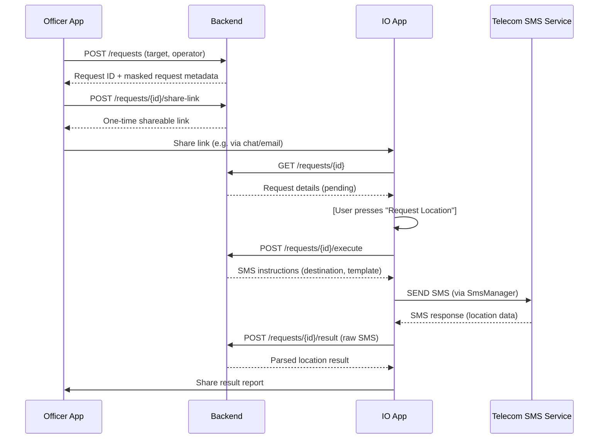
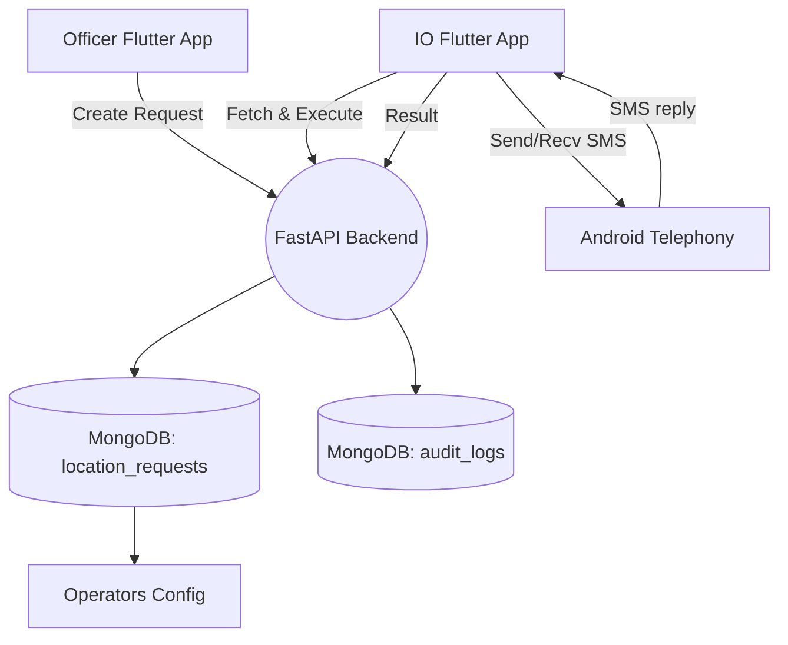

# Executive Summary

This document defines the **IFSO Location Request Management System**, a secure mobile solution to automate investigative location requests via SMS.  It replaces the current manual copy-&-SMS workflow with a coordinated mobile app and backend service.  Authorized officers enter target numbers and select the operator, generating a tokenized request.  The Investigating Officer (IO) reviews pending requests, then triggers the system to send an SMS from the IO’s own device/SIM to the telecom operator.  The returned SMS response is automatically captured, parsed, and stored.  All actions are logged for audit and chain-of-custody.  The system emphasizes security (authentication, least privilege), privacy, and reliability.  Key components include Flutter-based mobile UIs, a FastAPI backend, a MongoDB data store, and an Android native SMS bridge.  We present a core workflow, feature list, technical architecture (with Mermaid diagrams), data/API schema, and an implementation roadmap.  

**Key Benefits:** Reduces transcription errors, enforces proper authorization, provides an auditable record of each request, and accelerates location retrieval.  Supports real-world forensic process with minimal user effort while complying with best practices (SMS permissions, app distribution, and evidence handling).

## Core Principle / Product Overview

- **Goal:** Automate forensic mobile-location requests for law enforcement, ensuring that only authorized IO devices send SMS queries to telecom operators, and that all data flows are logged.  
- **Approach:** Officers create "Location Request" entries via a mobile UI, storing the target number, operator (e.g. JIO, Airtel), case ID, and any notes.  A secure shareable link notifies the IO.  The IO app retrieves the request, confirms it, and the native Android layer sends an SMS from the IO’s SIM using operator-specific templates (see _Operator Profiles_).  Incoming SMS replies are intercepted (via a BroadcastReceiver) and relayed to the backend.  
- **Architecture:** Cross-platform Flutter apps for officers and IO, communicating with a Python/FastAPI backend.  MongoDB stores requests and logs in JSON documents.  The IO app uses a Kotlin/Java bridge to Android’s `SmsManager` API for SMS send/receive.  All network calls use TLS (HTTPS) and JSON.  Audit logging is embedded at every step.  

## Detailed Core Workflow and Main Components

1. **Officer Input:** Multiple field officers use a Flutter app to submit numbers.  They enter the target mobile number, select operator (e.g. JIO/Airtel/VI/BSNL), and include a case reference or remarks.  
2. **Request Creation:** The backend assigns a request ID (e.g. `LR-2026-00041`), normalizes the number (adding country code), encrypts the normalized number for storage, and stores the record with status *PENDING_IO_APPROVAL*.  It returns safe request metadata; a tokenized link (e.g. `https://server/req/XYZ123`) is minted only through an explicit share action that the officer uses to notify the IO.  
3. **IO Notification:** The IO gets notified (via the link or email) and opens the request in their IO app.  The app fetches request details from the backend.  
4. **IO Authorization:** The IO verifies the information and taps **“Request Location”**.  This action sends a signed HTTPS call to the backend to mark the request as *EXECUTING*.  
5. **SMS Composition & Send:** The backend responds with operator-specific SMS instructions (prefix, destination number, message template).  The IO app’s native module formats the SMS (e.g. add country code “91” + number) and invokes `SmsManager.sendTextMessage()`.  The SMS appears in the carrier network as coming from the IO’s own phone/SIM.  
6. **SMS Delivery & Response:** The telecom operator’s automated system receives the SMS query and replies with a location SMS.  The IO device’s `BroadcastReceiver` catches the `Telephony.SMS_RECEIVED` intent.  The raw SMS text is forwarded to the IO app.  
7. **Parsing & Storage:** The IO app sends the SMS text to the backend.  A parsing service uses regex (based on known operator formats) to extract coordinates or address (see *SMS Parsing* below).  Both raw SMS and parsed results are saved.  The request status changes to *COMPLETED*.  
8. **Results & Sharing:** The IO app displays the parsed location.  The IO can then tap **“Share Result”**, which generates a secure view or PDF that is sent back to the requesting officer (e.g. via email or chat), including timestamp, target (partially masked), operator, and location.  



## Product Vision

Enable timely, auditable law-enforcement location requests with minimal manual work.  Over time, integrate with case-management and multi-agency workflows.  Enhance with GIS visualizations (e.g. map plotting of results) and support for other call-tracing sources (e.g. cell tower).  The vision is a unified **Mobile Forensics Toolkit** that simplifies routine investigative tasks (location lookup, logging, reporting) while preserving strict forensic controls.  

## Problem Statement

Current process: IOs manually copy numbers from messages, format SMS commands per operator, and send from the authorized line.  This is error-prone (mistyped numbers/prefixes), non-auditable (no logs of who sent what), and labor-intensive.  The IO is a bottleneck (others must wait while IO does manual entry).  We need to **automate and audit** this workflow.  The solution must ensure only the IO’s device/SIM sends the query (to satisfy telecom access rules) yet allow officers to queue requests.  It must preserve evidentiary integrity (no modification of target data, full timestamps, chain-of-custody logging) and comply with SMS permission rules.  

## Target Users and Needs

- **Investigating Officers (IOs):** Need to approve requests and trigger SMS in one tap, see results, and share them.  Require strong access control (only IO’s login/SIM can send SMS).  Need clear audit trail (who created request, when, SMS logs, etc.).  
- **Field Officers:** Need a quick way to submit target numbers with correct formatting.  Benefit from shareable request links so they don’t have to message the IO directly.  Expect minimal training.  
- **Forensics Team / Admin:** Need logs for chain-of-custody, configurable operator templates, and oversight of the system usage (audit logs, usage metrics).  They may manage user accounts and retention policies.  

## User Roles

- **Officer:** Can create and view their own requests, generate share links, and receive final results. Cannot send SMS or trigger execution.  
- **Investigating Officer (IO):** Can view and act on requests addressed to them. Can execute (send SMS) and view results. May also have Officer rights.  
- **System Admin:** (Future) Manage operator profiles, user accounts, view logs, enforce retention. Not in MVP scope.  

## Product Features

- **Secure Authentication:** Users log in to the app (initial MVP: a simple PIN or pre-shared key; future: OAuth/JWT).  Only an IO’s login can execute requests.  
- **Tokenized Share Links:** Each request generates a random token link (e.g. `/r/<token>`) so the IO can open it without transferring raw numbers.  Tokens are single-use and expire.  
- **Operator Profiles:** Configurable templates per carrier (e.g. JIO template, Airtel template) and number normalization rules (country code “91”).  Allows adding new carriers without code changes.  
- **SMS Bridge:** A native Android service (via Flutter platform channels) that calls `SmsManager.sendTextMessage()`.  The IO app will request `SEND_SMS`, `RECEIVE_SMS` permissions (declared in manifest).  No SMS logs are saved on-device (use `sendTextMessage` instead of `sendTextMessageWithoutPersisting`).  
- **Incoming SMS Receiver:** A BroadcastReceiver listens for `Sms.Intents.SMS_RECEIVED_ACTION`. Only relevant responses (matching the request context) are captured and forwarded to backend.  
- **Parsing & Indicators:** Using regex or parsers, the system extracts latitude/longitude or address from the operator’s SMS text.  For example: 
    ```python
    # Example regex to extract coordinates from "LAT:12.3456, LONG:78.9012"
    import re
    pattern = r"LAT:(\\d+\\.\\d+), LONG:(\\d+\\.\\d+)"
    match = re.search(pattern, sms_text)
    if match:
        latitude, longitude = match.groups()
    ```
  Templates and parsing rules are maintained per operator (unspecified here, provided by IFSO).  
- **Audit Trail:** Every request/change is logged with timestamps and user ID.  Backend records SMS send time, delivery status, raw response, and parsed result.  Immutable logs preserve chain-of-custody (“who did what and when”).  
- **Result Sharing:** The IO app can export/share the response (masked number, location, timestamps) as a text or JSON report.  Can integrate with email or messaging.  Ensures no manual copy-paste of sensitive data.  
- **Security:** Minimal permissions (just SMS and Internet).  Data in transit is encrypted (HTTPS).  Optionally, data at rest is encrypted (MongoDB encryption).  Use JWT tokens or API keys for app-backend auth.  The IO’s Android device must be trusted (screen lock, MDM policies) to protect SIM use.  
- **Limitations Acknowledgment:** Report clarifies this is evidence intake only (no code execution) and that returned “location” is operator data, which must be corroborated.

## End-to-End User Journey

1. **Officer Flow:** Officer opens the app → logs in (Officer role) → taps “New Request” → enters number + operator + case ID → submits.  The app shows request ID and link.  Officer shares link to IO (e.g. via chat).
2. **Backend:** Receives POST `/requests`; generates tokenized URL; saves in `location_requests` collection (see Data Model).  
3. **IO Flow:** IO clicks link or opens app and enters request ID → IO app fetches GET `/requests/{id}` → displays target details (number hidden, e.g. ********3210), operator, submitter info. IO taps “Request Location”.  
4. **Backend:** Receives POST `/requests/{id}/execute`; verifies IO identity; marks request EXECUTING; returns SMS sending data (normalized number, operator profile).  
5. **IO App:** Native module composes SMS (e.g. `"LOCAT 919876543210"`) and sends via `SmsManager.sendTextMessage()`.  
6. **Telecom:** Receives query, sends back “Location is LAT:12.3456, LONG:78.9012” SMS.  
7. **IO App:** BroadcastReceiver catches incoming SMS, filters by matching criteria (request ID, sender).  Sends content to backend POST `/requests/{id}/result`.  
8. **Backend:** Saves raw SMS and runs parser → stores structured location. Changes status to COMPLETED.  
9. **IO App:** Polls backend or receives push, then displays location on map/text. IO taps “Share Result” to send to Officer.  

```mermaid
flowchart LR
    subgraph Mobile Apps
      OfficerApp[Officer App (Flutter)] 
      IOApp[IO App (Flutter + Android SMS Bridge)]
    end
    subgraph Backend Server
      API[FastAPI API (Python)]
      DB[(MongoDB)]
    end
    Carrier[Telecom SMS Service]
    
    OfficerApp -->|HTTPS REST| API
    IOApp -->|HTTPS REST| API
    API --> DB
    IOApp -->|SmsManager| Carrier
    Carrier -->|SMS_RECVD| IOApp
    
    style OfficerApp fill:#eef,stroke:#336,stroke-width:2px
    style IOApp fill:#eef,stroke:#336,stroke-width:2px
    style API fill:#efe,stroke:#393,stroke-width:2px
    style DB fill:#efe,stroke:#393,stroke-width:2px
    style Carrier fill:#fee,stroke:#933,stroke-width:2px
```

*Figure: High-level architecture. Officer and IO use Flutter apps. IO app (Flutter + Kotlin) invokes Android telephony APIs. FastAPI backend with MongoDB stores data. TLS protected.*

## Functional & Non-Functional Requirements

- **Functional:**
  - *FR1:* Officers can create requests with number/operator.
  - *FR2:* System generates unique token link for each request.
  - *FR3:* IO can retrieve request, authorize, and trigger SMS.
  - *FR4:* System sends SMS via IO’s SIM (using `SmsManager.sendTextMessage()`).
  - *FR5:* Incoming SMS responses are captured by the app.
  - *FR6:* Response is parsed and stored (raw + structured).
  - *FR7:* Result sharing to officer.
  - *FR8:* Audit logs of all actions (who/when).
- **Non-Functional:**
  - *Performance:* System should handle up to N requests/day with response in <30s.  
  - *Availability:* Backend uptime ≥99.5%.  Mobile app works offline except for sending/receiving SMS via network.
  - *Security:* Data in transit via HTTPS. Apps request only necessary permissions (SMS, Internet). Store tokens/keys in Android Keystore. JWT or API keys for auth. All critical operations require authentication.
  - *Privacy:* Target phone numbers are treated as PII; stored securely, masked in UI.  
  - *Legal/Chain-of-Custody:* Maintain immutable logs (timestamp, user, action) for all steps. Data retention configurable (e.g. 5 years).
  - *Logging:* Detailed logs (request creation, SMS send status, response raw text) stored in MongoDB.  
  - *Retention:* Follow IFSO policies (e.g. archive or purge old data after case closure).  Not currently in MVP.

## Technical Architecture & Component Responsibilities

- **Flutter Mobile App:** Shared codebase for Officer and IO UIs. Handles input forms, displays requests/results. Communicates with backend via REST. Uses a native plugin (MethodChannel) for SMS functions.
- **Android SMS Bridge:** Native Kotlin/Java module invoked by Flutter. Calls `SmsManager.sendTextMessage()` to send SMS from the IO’s SIM. Registers a `BroadcastReceiver` for `Sms.Intents.SMS_RECEIVED_ACTION` to intercept incoming replies.
- **FastAPI Backend (Python):** Exposes REST endpoints. Validates requests, enforces roles/permissions. Manages operator templates, request state, parsing logic. Uses Pydantic models for request/response schemas. Generates tokenized links. Stores and retrieves data from MongoDB.
- **MongoDB Database:** Stores collections of requests, operator profiles, and audit logs. Each document is JSON-like (BSON), flexible for varied SMS formats. E.g. `location_requests` document holds the entire lifecycle of a request (see *Data Model* below).
- **Operator Profile Config:** JSON/YAML definitions (could be in DB or file) defining how to format SMS for each carrier and regex patterns to parse responses. For example: 
  ```json
  {
    "JIO": {
      "prefix": "91",
      "sms_number": "1512",
      "sms_template": "LOCAT %s"
    }
  }
  ```
- **Security Layer:** Utilizes JWT tokens or API keys (e.g. [46]) for authenticating API calls. Flutter app stores tokens in secure storage. HTTPS enforced. Optional: device attestation to bind requests to authorized IO devices.  



*Figure: Component architecture. Boxes represent services/databases; arrows indicate data flow. Components should be containerized (Docker) for deployment.*

## Technology Stack Justification

- **Flutter (Dart):** Google’s cross-platform UI SDK. One codebase for Android (and potentially iOS) apps. Rich UI framework for quick forms, and easy integration via MethodChannel for native SMS operations.  
- **Kotlin (Android SMS Bridge):** Leveraging Android’s native Telephony APIs. The `SmsManager` class provides `sendTextMessage()` (requires `SEND_SMS` permission). We cannot use `sendTextMessageWithoutPersisting()` (carrier-only).  Kotlin code listens for incoming SMS via `BroadcastReceiver` and forwards to Flutter.  
- **FastAPI (Python):** Modern, high-performance async web framework. Auto-generates OpenAPI docs. Supports OAuth2/JWT natively. Well-suited for JSON APIs and quick development of the REST backend.  
- **MongoDB:** Document-oriented DB for flexible schema (JSON/BSON). Ideal for storing heterogeneous request logs (with embedded subdocuments, arrays of events). Offers easy scalability (sharding/replication if needed).  
- **Docker:** Containerize backend and potentially an API server for deployment consistency.  
- **JWT / OAuth2:** For stateless authentication of users/services (FastAPI has built-in support).  
- **HTTPS/TLS:** All communication protected by TLS (standard `secure://` endpoints). Ensures confidentiality of targets and results.  

This stack is lightweight for a 10–15 day project, leverages existing expertise (Python, Flutter), and meets performance needs (FastAPI is one of fastest Python frameworks).

## Data Model (MongoDB Collections)

All data is stored in JSON-like documents (BSON). Key collections:

| **Collection**        | **Example Document (JSON)**                                                                                                                                                 |
|-----------------------|----------------------------------------------------------------------------------------------------------------------------------------------------------------------------|
| `location_requests`   | ```json<br>{<br>  "request_id": "LR-2026-00041",<br>  "case_id": "CASE-123",<br>  "target_number": "919876543210",<br>  "operator": "JIO",<br>  "submitted_by": "officerA",<br>  "status": "COMPLETED",<br>  "submitted_at": "2026-10-01T12:00:00Z",<br>  "executed_by": "IOuser",<br>  "executed_at": "2026-10-01T12:05:00Z",<br>  "sms_sent": true,<br>  "sms_raw_response": "Location: LAT:12.3456, LONG:78.9012",<br>  "parsed_result": { "lat": 12.3456, "lon": 78.9012 },<br>  "shared": true<br>}``` |
| `operators`          | ```json<br>{<br>  "operator": "JIO",<br>  "country_code": "91",<br>  "sms_center_number": "1512",<br>  "sms_template": "LOCAT %s",<br>  "response_regex": "LAT:(\\d+\\.\\d+), LONG:(\\d+\\.\\d+)"<br>}```           |
| `audit_logs`         | ```json<br>{<br>  "timestamp": "2026-10-01T12:05:00Z",<br>  "user": "IOuser",<br>  "action": "EXECUTE_REQUEST",<br>  "request_id": "LR-2026-00041",<br>  "details": "SMS sent to operator JIO"<br>}```            |

*Notes:* Optional fields like `shared_at`, `recipient` can be added. Collections can grow with indexes on `request_id` and timestamps. The `operators` collection is for config; in MVP it can be hardcoded or managed by code.

## API Structure

Endpoints (authentication required on all):

| Endpoint                   | Method | Auth Role   | Request Body / Query                         | Response                                    |
|----------------------------|--------|-------------|----------------------------------------------|---------------------------------------------|
| `POST /requests`           | POST   | Officer     | `{target_number, operator, case_id, remarks}`| `{"request_id","target_masked","status"}`   |
| `POST /requests/{id}/share-link` | POST | Officer owner/Admin | None | `{"request_id","share_link"}` once |
| `GET /requests/{id}`       | GET    | IO/Officer? | `id` in URL (tokenized); no body             | `{"target_masked","operator","status",...}` |
| `POST /requests/{id}/execute` | POST | IO Only    | None (just auth)                             | `{"status":"EXECUTING","sent":true}`        |
| `POST /requests/{id}/result`  | POST | System (IO) | `{ "sms_text": "...", "sms_from": "..."} `    | `{"status":"COMPLETED","parsed":{...}}`     |

- **Authentication:** Use JWT tokens. The Officer app and IO app obtain tokens on login and include in `Authorization: Bearer <token>`.  FastAPI’s OAuth2PasswordBearer can be used.
- **Schemas:** Use Pydantic models for request validation (e.g. ensure number format, required fields). Responses are JSON.
- **Error Handling:** Return appropriate HTTP codes (401 unauthorized, 400 bad request, 404 not found, 500 server error) with JSON error messages.

*(Other possible endpoints for extension: listing requests, re-authentication, user management.)*

## Storage and Retention Policy

- **Data at Rest:** MongoDB should use encrypted storage (WiredTiger encryption) where available. The backend must also protect sensitive fields at the application layer when required; current Phase 2 stores target phone numbers as encrypted ciphertext with only masked/hash derivatives in ordinary records and responses.
- **Retention:** Align with IFSO policy (e.g. retain all logs/requests until case closed + N years). Possibly implement TTL indexes on collections for automated purge after legal retention period.  
- **Backups:** Regular encrypted backups of the database. Only authorized admin keys should access DB.  
- **Deletion:** Upon case closure or legal request, specific entries can be redacted (e.g. remove coordinates but keep logs) as per chain-of-custody requirements.

## MVP Scope & 10–15 Day Milestone Plan

A lightweight MVP focusing on core functionality (Officer + IO flows, SMS send/receive, data logging). No UI cosmetics beyond necessary, no advanced auth or deployment concerns. Daily plan:

| Day  | Tasks                                                    | Deliverables                                                      |
|------|----------------------------------------------------------|-------------------------------------------------------------------|
| 1    | Project scaffolding: repo, directories, tech setup (Flutter, FastAPI, Mongo). | Repository with `app/`, stub backend endpoints, basic Flutter app layout. |
| 2    | Implement `POST /requests` (FastAPI) & Mongo model. Officer UI form to submit a request. | Officer can submit number/operator; backend saves protected record and returns safe metadata. |
| 3    | Tokenized link generation and `GET /requests/{id}`. Link view skeleton. | IO app can open link (or manually enter ID) and see request details (pending). |
| 4    | IO “Request Location” action. Backend state change to EXECUTING. | IO app button wired; backend updates status; minimal confirmation shown. |
| 5    | Android SMS send: Flutter->Kotlin bridge. Ask for `SEND_SMS` permission. | IO app sends actual SMS via `SmsManager.sendTextMessage()`. (Test stub number). |
| 6    | Android SMS receive: implement BroadcastReceiver for `SMS_RECEIVED`. | IO app logs incoming SMS (raw) to Flutter (test with loopback SMS). |
| 7    | Backend `POST /requests/{id}/result`: receive raw SMS text. | IO app forwards SMS text to backend; backend stores it. |
| 8    | Parsing logic: write sample regex for demo operator. Display result on IO UI. | Parsed location shown to user; JSON stored (as in data model). |
| 9    | Audit logging and data model finalization. | All actions (create, exec, receive) generate audit log entries in MongoDB. |
| 10   | Officer result sharing: implement “Share Result” (text/PDF). | Officer receives result via email/message (can be simulated printout). |
| 11   | API and data validation, error handling. | Add input validation (e.g. valid number format), handle SMS failures, etc. |
| 12   | Basic auth: implement token-based login (JWT) and attach user info. | Users must log in to create/execute; tokens tested. |
| 13   | Testing with harmless demo: simulate operator SMS reply. | Conduct end-to-end demo with dummy data; fix issues. |
| 14   | Documentation: inline code comments, README, API docs. | Draft README and usage instructions; sample JSON of output report. |
| 15   | Buffer & polish: minor UI fixes, internal review. | Final sanity check; prepare deliverables (repo, demo video/notes). |

(This schedule assumes familiarity with tools; some tasks may overlap.  Rapid backend/front-end prototyping enabled by Flutter and FastAPI.)

## Advanced Features Roadmap

Future iterations (post-MVP) may include:

- **Role-Based Authentication:** Full user accounts, roles (Officer vs IO), password management, MFA.
- **Case Management Integration:** Link requests to case records, allow bulk import of numbers, case notes.
- **Multi-IO Support:** Assign requests to specific IOs, manage queues, notifications (push or SMS alerts to IO).
- **Geo-Plotting:** Map view of location results; integration with GIS/mapping APIs.
- **Analytics/Dashboard:** Stats on number of requests, average response time, operator reliability (success rates), usage metrics (KPIs below).
- **Interoperability:** Export results as official report (PDF with logos, signed by IO).
- **Data Protection:** Full encryption at rest, GDPR/IT Act compliance for PII, data anonymization where possible.
- **Policy Enforcement:** Ensure app can only run on enterprise-managed devices; disable screenshots or background logging.
- **Alternate Channels:** If telecom APIs become available, integrate with official web services or law enforcement portals.
- **Internationalization:** Support other telecoms or regions with similar SMS-based services.

## Success Criteria and KPIs

- **Reduction in Manual Steps:** Measured time from request to result vs. manual baseline. Aim for ≥50% faster.  
- **Error Rate:** Compare typos/misformatted numbers per 100 requests (pre vs post). Target zero mis-dials.  
- **Adoption:** At least 100% of IO requests handled via the app (tracked by “requests” count).  
- **Throughput:** Number of location requests processed per day. (Scales with user need.)  
- **System Uptime:** Maintain 99% availability during business hours.  
- **Audit Completeness:** 100% of actions logged.  (Verification via random audit check.)  
- **User Satisfaction:** Qualitative feedback (UI ease, fewer mistakes).  
- **Security Events:** Zero unauthorized SMS sends or data leaks.  Monitor via logs and MDM reports.  

## Security Considerations & Risk Mitigation

- **Permissions:** Requires `SEND_SMS` and `RECEIVE_SMS` on IO device. If denied, location cannot be requested. *Mitigation:* Check permissions at startup; guide IO to grant SMS access.
- **Device Trust:** IO’s smartphone security (PIN, encryption) is assumed. *Mitigation:* Recommend enterprise device management (MDM) to enforce screen-lock, prevent rooting.
- **Least Privilege:** The app declares only necessary permissions. Officers’ devices don’t need SMS at all (only INTERNET).  
- **API Security:** Use HTTPS and authenticate every call. *Risk:* Token theft. *Mitigation:* Use short-lived JWTs, store in secure storage, support remote revocation.
- **Data Privacy:** Numbers and locations are sensitive. *Risk:* Data leakage. *Mitigation:* Mask numbers in UI (show last 4 digits only), encrypt database, limit log access to authorized personnel.  
- **SMS Spoofing/Injection:** The SMS parser must validate message origin (e.g. only parse SMS from known operator number). *Mitigation:* Check `sms_from` matches operator’s number (if known) before trusting content.  
- **Logging Integrity:** Logs could be tampered if attacker gains DB access. *Mitigation:* Use append-only logs, or periodically hash logs.  
- **Legal Compliance:** Unsupervised location tracking can have legal risk. *Mitigation:* Only approved IOs can initiate, with logged justification (case ID). Retain logs for audits.  
- **Google Play Policy:** If distributing via Play, SMS permissions are highly restricted (default SMS app requirement). In-house distribution (e.g. enterprise APK or MDM push) may be required. *Mitigation:* Deploy outside Play, or seek approval for SMS functionality under permitted use-cases.  

| **Risk**                          | **Mitigation**                                                   |
|-----------------------------------|------------------------------------------------------------------|
| IO app cannot send SMS (perm denied or Google policy) | Deploy via enterprise (MDM), instruct IO to set as default SMS handler if needed. |
| Incorrect number/operator input   | Input validation, operator drop-down (no guess by prefix).       |
| SMS parsing fails (unexpected format) | Store raw SMS; flag unparsed responses; allow manual fallback.  |
| Unauthorized access               | Strict auth (JWT + roles), short token lifetime, audit all requests. |
| Data breach                       | Encrypt sensitive fields, limited access roles, regular audits.  |
| Device compromise                 | MDM policies, remote wipe capability for lost device.            |
| System downtime                   | Deploy backend with redundancy; use Docker/monitoring.           |
| Legal challenges (evidence admissibility) | Preserve chain-of-custody logs (timestamp, user, status). Clear disclaimers that system is “analysis only, not proof” in report. |

By following these mitigations, we maintain a secure, compliant tool that significantly streamlines location request investigations without introducing undue risk.
